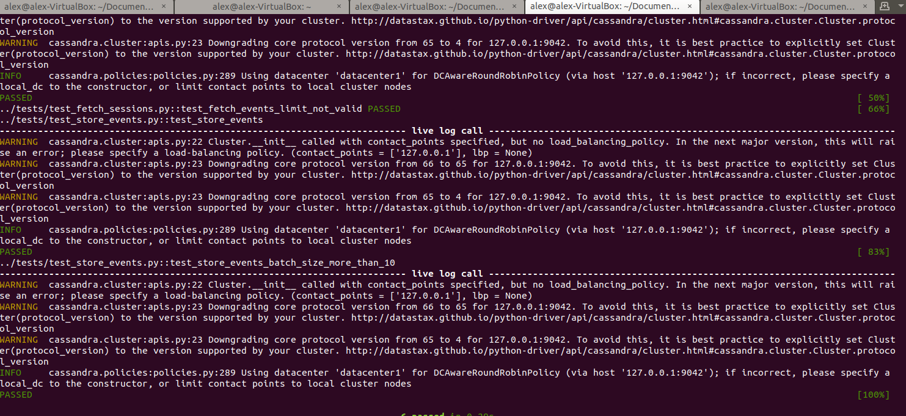

# INSTRUCTIONS FOR PLAYER SESSION INSIGHTS
* Python 3.8.0,pyspark=3.0.0 and  pandas=1.2.0 were used for this experiment
You can use miniconda 3 to set up the environment in order to run the application. This is optinal step 

1. Download and install [miniconda 3] https://docs.conda.io/projects/conda/en/latest/user-guide/install/linux.html
2. Install the existing yml file player_session_insights.yml 
`
conda env create --name player_session_insights  --file=player_session_insights.yml
conda activate player_session_insights
python -m ipykernel install --user --name=player-session-insights
`
3. Create directory data and transfer file assignment_data.jsonl.bz2 data/
4. Load notebook on jupyter notebook player_session_insights.ipynb

# INSTRUCTIONS FOR PLAYER SESSION SERVICES
* The application was created using python=3.8.0, flask=1.1.2, gunicorn=20.0.4, cassandra-driver=3.24.0
* 2 tables were created pss_cassandra.event_start pss_cassandra.event_stop. DB schema can be found in player_session_service/data/schema.cql
* No data are removed, data older than 1 year are discarded during the api request

## How to run the application
You can use miniconda 3 to set up the environment in order to run the application. This is optinal step 

1. Download and install [miniconda 3] https://docs.conda.io/projects/conda/en/latest/user-guide/install/linux.html
2. Install the existing yml file player_session_services.yml 
`
conda env create --name player_session_services --file=player_session_services.yml
conda activate player_session_services
`
3. Start cassandra as a docker container
`
sudo docker run --name my-cassandra --network host -d cassandra:latest -p 9042:9042
sudo docker cp player_session_service/data/schema.cql  my-cassandra:/tmp/schema.cql
sudo docker exec -it my-cassandra cqlsh -f /tmp/schema.cql
`
4. Transfer file assignment_data.jsonl.bz2 in /player_session_service/data

5. Start application
`
cd /player_session_service/src
gunicorn --config ../configuration/gunicorn.cfg "wsgi:createApplication()"
`
6. Make API requests
	- API for receiving event batches(1-10)
		`
		curl -X POST http://localhost:5001/api/v1/store_events/8
		`
		> {"message": "8 sessions added"}
	- API for fetching last 20 complete sessions for a given player
		`
		curl -X GET http://localhost:5001/api/v1/fetch_sessions/0a2d12a1a7e145de8bae44c0c6e06629/20
		`
		> [{'player_id': '0a2d12a1a7e145de8bae44c0c6e06629', 'session_id': '6d86c4c1-08f0-4919-8545-eb804bb7cc64', 'end_ts': '2016-11-26 13:17:31', 'country': 'GS', 'start_ts': '2016-11-26 13:10:30'}, {'player_id': '0a2d12a1a7e145de8bae44c0c6e06629', 'session_id': '7e00ebec-6479-4a6f-abb5-5baf50df706c', 'end_ts': '2016-11-11 21:36:38', 'country': 'GS', 'start_ts': '2016-11-11 19:59:49'}]}

## How to run the tests
* A separate environment was created in order to run tests using pytest-flask=1.1.0 and pytest=6.2.1,
flask version, cassndra-driver is  the same as above.

* You can use miniconda 3 to set up the environment in order to run the application. This is optinal step 

1. Download and install [miniconda 3] https://docs.conda.io/projects/conda/en/latest/user-guide/install/linux.html
2. Install the existing yml file player_session_services_test.yml 
`
conda env create --name player_session_services_test --file=player_session_services_test.yml
conda activate player_session_services_test
`
3. Start cassandra as a docker container
`
sudo docker run --name my-cassandra --network host -d cassandra:latest -p 9042:9042
sudo docker cp player_session_service/data/schema.cql  my-cassandra:/tmp/schema.cql
sudo docker exec -it my-cassandra cqlsh -f /tmp/schema.cql
`
4. Populate the DB with all data
5. Run tests
`
cd /player_session_service/src
sudo docker run --name my-cassandra --network host -d cassandra:latest -p 9042:9042
`
6. All tests are expected to pass

